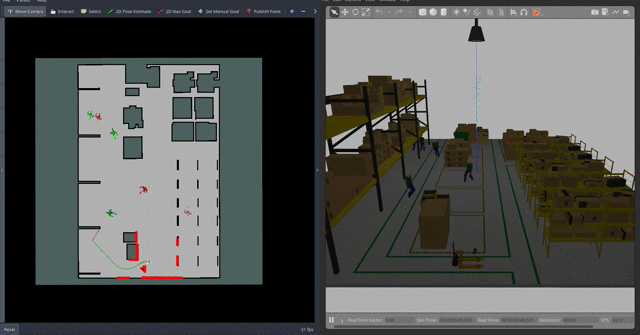
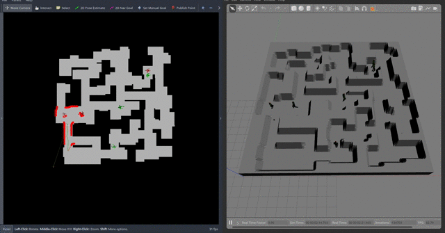

# Arena-Rosnav-3D

This repository is the 3D version of the navigation platform [arena-rosnav-2D](https://github.com/ignc-research/arena-rosnav). It is build on the 3D ROS simulator Gazebo and integrates with a modified Pedsim Simulator to provide realistic dynamic 3D scenarios and tasks to evaluate and and benchmark classic and learning-based ROS navigation approaches on multiple robot platforms. It is fully compatible with the planning algorithms trained and developed with [arena-rosnav-2D](https://github.com/ignc-research/arena-rosnav). This presents an essential step in deploying the navigation approaches from arena-rosnav towards real robots.

|||
|:--:       |              :--:|
| *Random task mode* | *Arena Generated* |

The repo currently contains:
- Local planners for dynamic obstacle avoidance: `teb`, `dwa`, `mpc`, `cadrl (DRL)`, `rlca(DRL)`, `arena (DRL)`, `rosnav (DRL)`
- Task generator with modes: `random`, `scenario`, `manual`, `staged`
- Multiple detailed scenario-worlds
- Robot models: `turtlebot3_burger`, `ridgeback`, `jackal`, `agv-ota`
- [Automated] Creation of random 3D-words with static and dynamic obstacles
- Realistic behavior patterns and semantic states of dynamic obstacles (by including pedsim's extended social force model, extended with industrial classes)
- Implementation of intermediate planner classes to combine local DRL planner with global map-based planners: `Spatial Horizon`, `Space-Time`, `Subsampling`
- Integration with [arena-tools](https://github.com/ignc-research/arena-tools) map generator and [LIRS-World_Construction_Tool](https://gitlab.com/LIRS_Projects/LIRS-WCT). Providing seamless conversion from randomly generated ROS maps to actual Gazebo worlds.
- "Random world" task mode, where with each Task reset, a new Gazebo world is loaded

## 1. Installation

Please refer to [Installation.md](docs/Installation.md) for detailed explanations about the installation process.

> ***NOTE***: This repo is using **ros-noetic** and **python 3.8**


## 2. Usage
<!-- The gui should currently not be used since it is not updated to include multi-robot support -->

<!-- For a finer user experience we provide a Python GUI, please have a look at [GUI.md](docs/GUI.md) for more information.
 -->

<!-- Otherwise please  -->
For more detailed explanations, we refer to [Usage.md](docs/Usage.md) for command-line use, as well as detailed explanations about agent, policy and training setups.


Arena-rosnav-3D is structurally very similar to [arena-rosnav](https://github.com/ignc-research/arena-rosnav) to allow easy switching between 2D and 3D environments. Currently, a large number of custom worlds and a random world generator are supported. You can include dynamic obstacles either in a *scenario* mode or in a *random* mode where the dynamic obstacle trajectories are determined randomly.

#### Worlds
We provide the following worlds:
||||||
|:--:       |              :--:|             :--:|          :--:|             :--:|
| *aws_house* | *turtlebot3_house* | *small_warehouse* | *random world* | *factory* |

|||||
|:--: |:--:|        :--:|      :--:|
| *hospital* | *experiment_rooms* | *bookstore* | *turtlebot3_world* |


#### World generation with arena-tools and LIRS
By combining the random 2d map generation feature from our own **arena-tools** with the seamless image to Gazebo world conversion of **LIRS_World_Construction_Tools** we can test our navigation approaches on magnitude of 3D worlds, varying in layout, complexity.
For more information on how to use this feature please refer to [arena-tools](https://github.com/Jacenty00/arena-tools). Otherwise, if you already have your own map image in mind, visit [LIRS_World_Construction_Tools](https://gitlab.com/LIRS_Projects/LIRS-WCT) to gain information on how to convert it into a Gazebo world.

---

#### Robots
We support different robots:
|||||
|:--:       |              :--:|             :--:|          :--:|
| *turtlebot3_burger* | *jackal* | *ridgeback* | *agv-ota* |

|||||
|:--:       |              :--:|             :--:|          :--:|
| *Robotino(rto)* | *youbot* | *turtlebot3_waffle_pi* | *Car-O-Bot4 (cob4)* |

All robots are equipped with a laser scanner. The robots differ in size, laser-range etc. See below table for more detailed information on each robot:


| Name  | Max Speed (v_x) [_m/s_]  | Max Speed (v_y) [_m/s_]  | Max Rotational Speed (θ_y) [_rad/s_]  | Radius [_m_] | Emergency-Stop¹ | Laser-range [_m_] | Holonomic² |
| :--- | :---:|  :---: |:---: |:---: |:---:|   :---:| :---:|
| *turtlebot3-burger*   | 0.22 | 0.0  | 2.84  | 0.113 | True | 3.5  | False |
| *jackal*              | 2.0  | 0.0  | 4.0  | 0.267 | True | 30.0 | False |
| *ridgeback*           | 1.1  | 0.5  | 2.0  | 0.625 | True | 10.0 | True  |
| *agv-ota*             | 0.5  | 0.0  | 0.4  | 0.629 | True | 5.0  | False |
| *rto*                 | 2.78  | 2.78  | 1.0 | 0.225 | False | 5.6  | True |
| *youbot*              |  0.8 |  0.8 |  1.2 | 0.347 | False | 5.6  | True |
| *turtlebot3_waffle_pi*| 0.26  | 0.0  | 1.82  | 0.208 | False | 3.5  | False |
| *Car-O-Bot4 (cob4)*   |  1.1 |  0.2 | 0.8 | 0.36 | True |  29.5 | True |

For additional / more detailed information about each robot:

+ [See the parameters needed for the **Navigation stack**](arena_navigation/arena_local_planer/model_based/conventional/config)
+ [See additional robot parameters like laser min/max [_rad_]](wiki/Laser-scanner-parameters)
+ See [_HERE_](arena_navigation/arena_local_planer/learning_based/arena_local_planner_drl/configs) for the definition of the robots action_spaces (needed for rl-based-training)

> ___NOTE___: The _emergency-stop_ capability is currently still being development, it will however be available on all robots.

## **Sample usage**

After successful installation, run the following command with your python-env activated (`workon rosnav`).

```bash
roslaunch arena_bringup start_arena_gazebo.launch local_planner:=teb task_mode:=random world:=small_warehouse actors:=6
```

### Training

To quick start drl training run the following lines. For more detailed information see [this](docs/DRL-Training.md) documentation.
```bash
roslaunch arena_bringup start_arena_gazebo.launch  train_mode:=true use_viz:=true  task_mode:=random

# in a new terminal
roscd arena_local_planner_drl
python scripts/training/train_agent.py --agent MLP_ARENA2D
```
### Evaluation
To benchmark the performance of your simulation and visualize your results with qualitative and quantitative plots like in the example below, see the documentation [here](arena_navigation/arena_local_planer/evaluation/arena_evaluation/readme.md)

|||
|:--:       |              :--:|
| *Exemplary qualitative plot* | *Exemplary quantitative plot* |

## Miscellaneous

- [How to include further world files](docs/Miscellaneous.md#How-to-include-further-world-files)
- [How to create more world files](docs/Miscellaneous.md#How-to-create-more-world-files)
- [How to speed-up gazebo simulation speed](docs/Miscellaneous.md#How-to-speed-up-gazebo-simulation-speed)
- [How to include further scenarios](docs/Miscellaneous.md#How-to-include-further-scenarios)
- [How to automate the scenario mode(for large scale benchmarking)](docs/Miscellaneous.md#how-to-automate-the-scenario-mode-for-large-scale-benchmarking)
- [How to include further robots](docs/Miscellaneous.md#how-to-include-additional-robot-models)
- [Link to project report](https://www.overleaf.com/9421739154ccngtqpdcvjj)

# Used third party repos:

- ROS navigation stack: http://wiki.ros.org/navigation
- Pedsim: https://github.com/srl-freiburg/pedsim_ros
- Small-warehouse world: https://github.com/aws-robotics/aws-robomaker-small-warehouse-world
- Small-house world: https://github.com/aws-robotics/aws-robomaker-small-warehouse-world
- Turtlebot3-robot & house-world: https://github.com/ROBOTIS-GIT/turtlebot3_simulations
- LIRS_World_Construction_Tool https://gitlab.com/LIRS_Projects/LIRS-WCT
- ros_maps_to_pedsim https://github.com/fverdoja/ros_maps_to_pedsim
